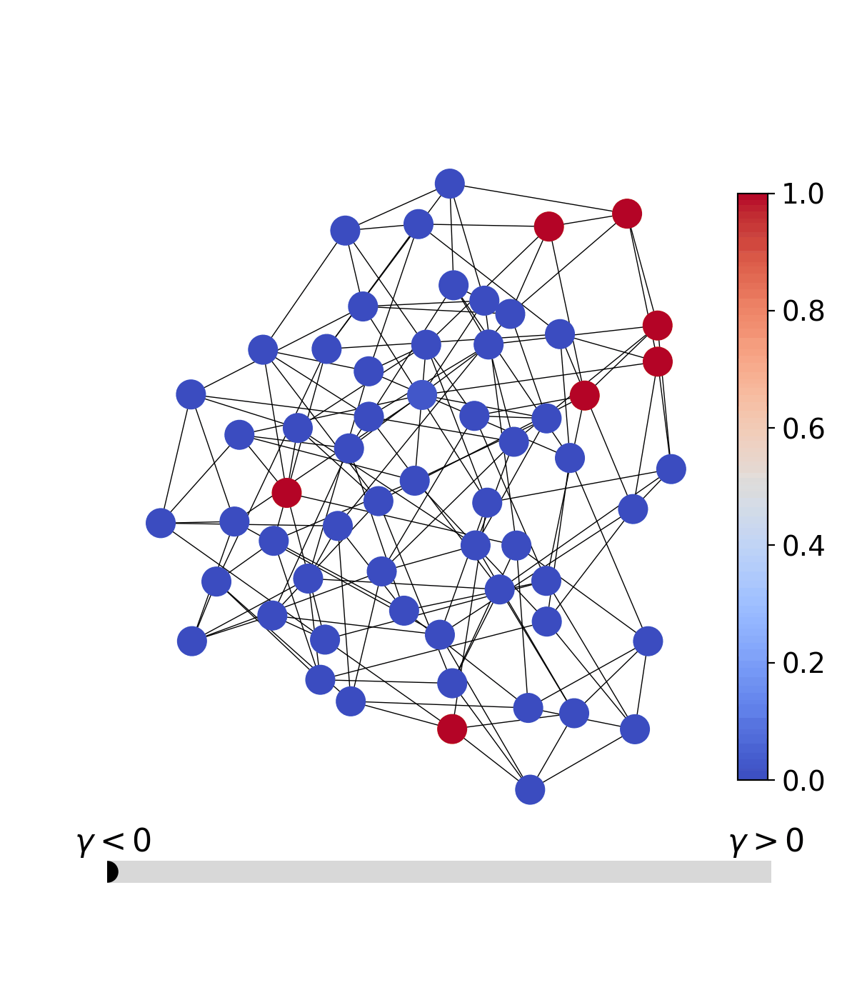

# QQA — Quasi-Quantum Annealing

PyTorch implementation of the ICLR 2025 paper
**[Continuous Tensor Relaxation for Finding Diverse Solutions in Combinatorial Optimization](https://openreview.net/forum?id=9EfBeXaXf0)**
by Yuma Ichikawa and Yamato Arai.

<p align="center">
  
</p>

**QQA** relaxes a discrete problem to a continuous, differentiable objective
and anneals towards a discrete minimum using gradient-based sampling. The
same loop handles combinatorial problems (MIS, Max-Cut, coloring, …) and
physics-flavoured spin problems (Ising, Edwards-Anderson, SK, binary
perceptron, Hopfield memory).

Highlights:

- **Unified Python API**: one `qqa.anneal()` for every problem.
- **Rich problem catalog** out of the box (10+ classes).
- **Interactive visualization**: matplotlib by default, Plotly optional.
- **CLI**: `qqa solve`, `qqa bench`, `qqa gui`, `qqa version`.
- **Streamlit GUI**: browser dashboard with live progress and sweep tools.
- **Docs site**: MkDocs + Material + auto API reference.

---

## Install

### With [uv](https://github.com/astral-sh/uv) (recommended)

```bash
git clone https://github.com/Yuma-Ichikawa/QQA4CO.git
cd QQA4CO
uv sync                                               # core only
uv sync --extra plotly --extra gui --extra dev        # with extras
uv run pytest -q                                      # sanity check
```

### With pip

```bash
pip install qqa                   # core
pip install "qqa[plotly]"         # + interactive plots
pip install "qqa[gui]"            # + Streamlit dashboard
pip install "qqa[all]"            # everything
```

## Quickstart

```python
import networkx as nx
import qqa

qqa.fix_seed(0)
g = nx.random_regular_graph(d=3, n=100, seed=0)
problem = qqa.MaximumIndependentSet(g, penalty=2)
result = qqa.anneal(problem, sol_size=100, num_epochs=1500)
print(f"MIS size: {-int(result.best_obj)}  in {result.runtime:.2f}s")
```

The same call style applies to spin problems:

```python
problem = qqa.SherringtonKirkpatrick(N=100, seed=0)
result = qqa.anneal(problem, sol_size=200, num_epochs=2000, verbose=False)
print(f"E_0 / N  ≈  {result.best_obj / 100:.4f}  (target ≈ -0.7632)")
```

## Problem catalog

| Category          | Classes |
| ----------------- | ------- |
| Binary QUBO       | `MaximumIndependentSet`, `MaxClique`, `MaxCut` (+ `*Instance` batched variants) |
| Categorical       | `Coloring`, `BalancedGraphPartition` |
| 1D Ising          | `Ising1D` |
| Spin glass        | `EdwardsAnderson`, `SherringtonKirkpatrick` |
| Statistical phys. | `BinaryPerceptron`, `HopfieldMemory` |

Read the full mathematical definitions in
[`docs/problems.md`](docs/problems.md).

## Command-line interface

```bash
qqa version
qqa solve --problem sk --size 100 --sol-size 128 --epochs 1000
qqa solve --problem mis --graph-file mygraph.gpickle --epochs 1500
qqa bench --preset er-small --epochs 500
qqa gui                                  # open http://localhost:8501
```

Run `qqa <command> --help` for the full option list.

## Streamlit GUI

```bash
pip install "qqa[gui]"
qqa gui
```

The dashboard has four pages:

- **Home** — pick a problem, size, seed, and problem-specific parameters.
- **Solve** — set QQA hyper-parameters and launch a run with a live
  progress bar, live metrics, and a streaming loss/best plot powered by a
  `StreamlitCallback`.
- **Visualize** — tabbed view of dynamics, best trajectory, the applied
  annealing schedule, and a solution heatmap.
- **Compare** — run a small hyper-parameter grid and inspect the result
  with parallel-coordinates and overlaid trajectories.

## Deploy to the public web (free)

The dashboard can be published for free via **Streamlit Community Cloud**
(or Hugging Face Spaces) and bridged from any domain you already own
(Xserver / お名前ドットコム / Cloudflare / …).

### 1. Deploy to Streamlit Community Cloud

The repository already ships the two files needed by Community Cloud:

- [`requirements.txt`](requirements.txt) — CPU-only PyTorch pin plus the
  minimal runtime. Installs this repo as the `qqa` package via the
  trailing `.`.
- [`.streamlit/config.toml`](.streamlit/config.toml) — on-brand dark
  theme and telemetry off.

Then:

1. Go to <https://share.streamlit.io> and sign in with GitHub.
2. **New app** → Repository `Yuma-Ichikawa/QQA4CO`, Branch `main`,
   Main file path `app/streamlit_app.py`.
3. Click **Deploy**. Your app will be served at
   `https://<something>.streamlit.app` after a 3–5 min build.

The custom-problem editor is **off by default** on public deployments
(it evaluates arbitrary Python via `exec`). Re-enable it on a trusted
machine with:

```bash
QQA_ALLOW_CUSTOM=1 uv run qqa gui
```

### 2. Point your own domain at the app

If you own a domain on a shared rental host (e.g. Xserver), drop this
snippet into the `public_html/` of the subdomain that you want to use
(adjust the target URL):

```apache
RewriteEngine On
RewriteRule ^(.*)$ https://qqa4co.streamlit.app/$1 [R=301,L]
```

A ready-to-copy template with both `301` and `iframe` variants lives at
[`deploy/xserver-htaccess.example`](deploy/xserver-htaccess.example).

### Other targets

The repository is portable enough to drop onto any of the usual
platforms: Hugging Face Spaces (Streamlit SDK), Fly.io / Render
(Docker), Google Cloud Run. The same `requirements.txt` and
`app/streamlit_app.py` serve as the entry points.

## Visualization

```python
from qqa import visualization as viz

viz.plot_history(result)                       # loss / penalty / diversity
viz.plot_best_trajectory(result, backend="plotly")
viz.plot_schedule(qqa.LinearBGSchedule(-2, 0.1), num_epochs=2000)
viz.plot_run_comparison([r1, r2, r3], labels=["lr=1", "lr=0.5", "lr=2"])
viz.plot_parallel_coordinates(sweep_df, objective="best_obj")
viz.plot_solution_heatmap(result, problem)
```

Every function accepts `backend="matplotlib"` (default) or `backend="plotly"`.
Plotly is optional; if it is not installed the plot silently falls back to
matplotlib.

## Notebooks

Eight runnable notebooks live in [`examples/`](examples/):

1. `01_maximum_independent_set.ipynb`
2. `02_graph_coloring.ipynb`
3. `03_max_cut.ipynb`
4. `04_edwards_anderson_3d.ipynb`
5. `05_sherrington_kirkpatrick.ipynb`
6. `06_binary_perceptron.ipynb`
7. `07_hopfield_memory.ipynb`
8. `08_parallel_benchmark.ipynb`

Regenerate them deterministically with
`uv run python scripts/_generate_notebooks.py`.

## Documentation

```bash
uv run mkdocs serve            # http://127.0.0.1:8000
uv run mkdocs build --strict   # produces site/
```

The docs cover quickstart, the full problem catalog with mathematical
definitions, GUI walk-through, visualization guide, auto-generated API
reference, and a migration guide from 0.2.x.

## Scripts

| Script | Purpose |
| ------ | ------- |
| `scripts/demo_mis.py`        | Minimal MIS end-to-end demo |
| `scripts/demo_coloring.py`   | 3-coloring end-to-end demo |
| `scripts/demo_parallel.py`   | Parallel instances of MIS |
| `scripts/bench_er_small.py`  | Benchmark on bundled ER-small MIS dataset |
| `scripts/_generate_notebooks.py` | Regenerate the shipped example notebooks |

Run any script via `uv run python scripts/<name>.py`.

## Repository layout

```
QQA4CO/
├── src/qqa/                 # importable package
│   ├── __init__.py
│   ├── annealing.py
│   ├── callbacks.py
│   ├── cli.py
│   ├── datasets.py
│   ├── legacy.py
│   ├── problems/            # qubo.py / categorical.py / spin.py
│   ├── relaxation.py
│   ├── schedule.py
│   ├── utils.py
│   └── visualization.py
├── app/                     # Streamlit dashboard
│   ├── streamlit_app.py
│   └── pages/
├── docs/                    # MkDocs site sources
├── examples/                # 8 example notebooks
├── scripts/                 # demo / benchmark scripts
├── tests/                   # pytest suite
├── data/                    # bundled datasets
├── pyproject.toml
├── CHANGELOG.md
├── CONTRIBUTING.md
├── CITATION.cff
└── README.md
```

## Contributing

Issues and pull requests are welcome. See
[`CONTRIBUTING.md`](CONTRIBUTING.md) for setup, style, and test commands.

## License

BSD-3-Clause — see [`LICENCE.txt`](LICENCE.txt).

## Cite

```bibtex
@inproceedings{ichikawa2025qqa,
  title     = {Continuous Tensor Relaxation for Finding Diverse Solutions in Combinatorial Optimization},
  author    = {Ichikawa, Yuma and Arai, Yamato},
  booktitle = {International Conference on Learning Representations (ICLR)},
  year      = {2025},
  url       = {https://openreview.net/forum?id=9EfBeXaXf0}
}
```
