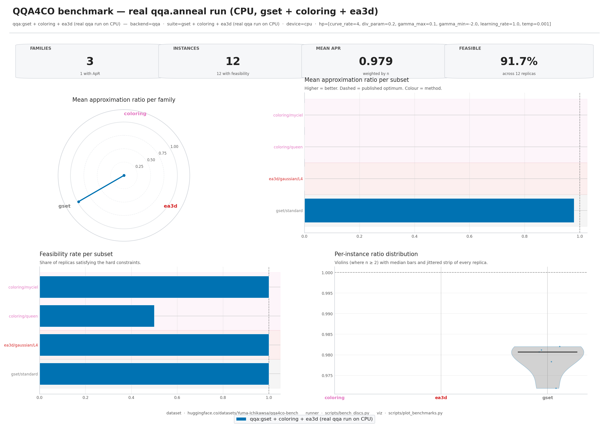

# Parallel Quasi-Quantum Annealer (PQQA)

A research-grade PyTorch toolkit for **continuous-relaxation combinatorial
optimisation**. PQQA unifies the recent line of work that *lifts* a
discrete CO problem into a continuous space and then solves it with
gradient descent — **PQQA** (ICLR 2025), the **CRA-PI-GNN** baseline
(NeurIPS 2024) and the **CPRA** diverse-solution framework (TMLR 2025) —
behind a single, GPU-friendly API. One installation gives you the PQQA
solver, an optional GNN backend that plugs in CRA-PI-GNN-style methods,
GPU-parallel **SA** and **Population Annealing** baselines for honest
comparisons, a 20+ class problem catalogue, a Streamlit dashboard and a CLI.
The same GPU-parallel engine now covers the full practical optimisation
spectrum: **single- and multi-objective**, **binary, integer, real, and mixed
variables**, constrained nonlinear and **black-box** objectives, plus optional
exact **SCIP** refinement and TeX-to-solver modelling.

The package is published on PyPI as **`qqa`** for backwards compatibility
with earlier QQA4CO releases (``import qqa``).

<p align="center">
  <a href="https://pypi.org/project/qqa/"></a>
  <a href="https://pypi.org/project/qqa/"></a>
  <a href="https://github.com/Yuma-Ichikawa/QQA4CO/blob/main/LICENSE"></a>
  <a href="https://github.com/Yuma-Ichikawa/QQA4CO/actions/workflows/ci.yml"></a>
  <a href="https://yuma-ichikawa.github.io/QQA4CO/"></a>
  <a href="https://github.com/Yuma-Ichikawa/QQA4CO/discussions"></a>
  <a href="https://codecov.io/gh/Yuma-Ichikawa/QQA4CO"></a>
  <a href="https://doi.org/10.5281/zenodo.19648231"></a>
  <a href="https://huggingface.co/datasets/Yuma-Ichikawa/qqa4co-bench"></a>
</p>

<p align="center">
  <b>Benchmark data &nbsp;·&nbsp;</b>
  <a href="https://huggingface.co/datasets/Yuma-Ichikawa/qqa4co-bench">
    <code>huggingface.co/datasets/Yuma-Ichikawa/qqa4co-bench</code>
  </a>
  <br>
  <sub>DISCS (NeurIPS 2023) + MaxCut G-set (Helmberg & Rendl 2000) + Graph Coloring (COLOR) + MIS on d-regular random graphs (PQQA §5.1) + 3D Edwards-Anderson spin glass + Balanced k-way partition — one HF dataset, <code>make bench-all-setup</code> pulls everything.</sub>
</p>

<p align="center">
  <a href="https://parallelquasiquantum4co.streamlit.app/">
    
  </a>
  &nbsp;
  <a href="https://colab.research.google.com/github/Yuma-Ichikawa/QQA4CO/blob/main/examples/00_colab_quickstart.ipynb">
    
  </a>
</p>

<h2 align="center">🌐 Try the Web dashboard — zero install, runs in your browser</h2>

<p align="center">
  <b><a href="https://parallelquasiquantum4co.streamlit.app/">→ parallelquasiquantum4co.streamlit.app</a></b>
  &nbsp;·&nbsp; hosted on Streamlit Community Cloud &nbsp;·&nbsp; CPU back-end &nbsp;·&nbsp; light / dark mode
</p>

<p align="center">
  <a href="https://parallelquasiquantum4co.streamlit.app/">
    
  </a>
</p>

The dashboard is a four-page Streamlit app that drives the same `qqa.anneal`
solver this README documents — pick a problem, watch the relaxed variables
discretise live, race PQQA against simulated annealing, and inspect the
parallel population in 3D solution-space PCA / loss-spectrogram views.

| Page | What you can do |
| --- | --- |
| **Home** | Pick from 19 problems (MIS, Max-Cut, MaxClique, Vertex Cover, GraphBisection, MinDominatingSet, Coloring, BalancedGraphPartition, TSP, QAP, NQueens, Knapsack, NumberPartitioning, MaxSAT3, 1D Ising, Edwards–Anderson, SK, p-spin, RFIM, BinaryPerceptron, HopfieldMemory). Auxiliary sliders are problem-aware. |
| **Solve** | Run PQQA / CRA-PI-GNN / CPRA with live progress, polish (1-flip local search) and warm-start toggles, and a per-problem solution viewer (TSP tour, NQueens board, highlighted IS, colouring, …). |
| **Visualize** | 10 tabs of post-hoc plots — **solution-space PCA** of the final parallel population (3D, replicas coloured by loss, global best highlighted), **loss spectrogram** over time, diversity, replica fate, schedule, ridgeline. |
| **Compare** | Hyper-parameter grid sweep with parallel-coordinates view, **and** a head-to-head **PQQA vs. SA vs. Population-Annealing shootout** that reports the wall-clock speed-up at matched compute budget. |

### Or run it locally — same UI, your hardware

```bash
pip install "qqa[gui]"        # pulls Streamlit + Plotly
qqa gui                       # opens http://localhost:8501
```

Or with uv:

```bash
uv sync --extra gui
uv run qqa gui
```

CUDA is picked up automatically when available.

---

## What's in the box

1. **The PQQA solver** (`qqa.anneal`) — a parallel, population-based annealer
   that lifts any QUBO / Ising / categorical / permutation problem into a
   continuous relaxation and minimises it with gradient descent + diversity
   regularisation. CPU / CUDA / MPS, deterministic with `qqa.fix_seed`.
2. **A 20+ class problem catalogue** spanning QUBO graphs (MIS, Max-Cut,
   MaxClique, Vertex Cover, Graph Bisection, Minimum Dominating Set),
   classic CO (Knapsack, NumberPartitioning, MaxSAT3), permutation problems
   (TSP, QAP, NQueens), categorical/assignment (graph Coloring, Balanced
   K-way Partition), spin glasses (1D Ising, Edwards-Anderson 2D/3D, SK,
   p-spin, Random-Field Ising) and statistical-physics models
   (BinaryPerceptron, HopfieldMemory). Every class implements the same
   `loss_fn` / `score_summary` contract, so the solver, CLI and dashboard
   are completely problem-agnostic.
   For custom planning and engineering models, `MixedProblem` combines
   named `Binary`, `Integer`, and `Real` variables plus differentiable
   `Constraint` objects in one GPU-vectorised solve.
3. **An optional GNN backend** (`qqa.pignn`, install with `qqa[pignn]`) that
   plugs **GNN-based unsupervised-learning CO solvers** into the same API.
   PQQA, the **CRA-PI-GNN** baseline (NeurIPS 2024) and the **CPRA**
   diverse-solution framework (TMLR 2025) all share `AnnealResult`,
   `score_summary`, the same problem builders and the same CLI flags — A/B
   comparing methods is one `--backend` switch away.
4. **GPU-parallel MCMC baselines** for honest head-to-head comparisons —
   classical **Simulated Annealing** (`qqa.simulated_annealing`) with a
   QUBO Glauber fast path, **Population Annealing**
   (`qqa.population_annealing`, Hukushima-Iba / Machta) with systematic or
   multinomial resampling between temperature steps, and the
   **iSCO sampler** (`qqa.discrete_langevin`, a.k.a. `qqa.isco_anneal`)
   of Sun et al., *Revisiting Sampling for Combinatorial Optimization*
   (ICML 2023), a full implementation of the paper's Algorithm 1 +
   Appendix C (path-auxiliary multi-flip MH with Poisson-length paths
   and adaptive μ targeting 0.574 acceptance). All three expose the
   same `best_sol` / `best_obj` / `history` / `polished_sol` surface as
   `qqa.anneal`, so the Streamlit *Compare* page can race PQQA against
   any of them at a matched compute budget.
5. **Universal optimisation workflows**: a one-run parallel Pareto solver,
   budget-aware mixed-variable black-box optimisation, optional QQA→SCIP
   refinement with optimality gaps, and a safe `qqa tex` interface that turns
   TeX into an auditable declarative model through an OpenAI-compatible API.
6. **A polished Streamlit dashboard** (light / dark, live progress, parallel
   population view, per-problem solution viz, hyper-parameter sweeps) and a
   `qqa` **CLI** (`solve / bench / gui / version`) for reproducible
   experiments. A hosted instance lives at
   <https://parallelquasiquantum4co.streamlit.app/>.
7. **MkDocs + Material reference docs** with auto-generated API pages, a
   runnable `examples/` notebook gallery (Open-in-Colab badges) and a
   `scripts/verify_all_problems.py` correctness sweep that benchmarks every
   problem against ground truth or a strong baseline (29 / 29 instances pass
   in the latest sweep — see [`docs/verification.md`](https://github.com/Yuma-Ichikawa/QQA4CO/blob/main/docs/verification.md)).

## Reference papers

QQA4CO implements and unifies the following peer-reviewed work:

1. **Optimization by Parallel Quasi-Quantum Annealing with Gradient-Based Sampling**
   — Yuma Ichikawa.
   *International Conference on Learning Representations (ICLR), 2025.*
   [[OpenReview](https://openreview.net/forum?id=9EfBeXaXf0)]
   The headline **PQQA** algorithm — parallel quasi-quantum annealing with
   gradient-based sampling. Implemented as `qqa.anneal`.

2. **Continuous Parallel Relaxation for Finding Diverse Solutions in Combinatorial Optimization Problems**
   — Yuma Ichikawa, Hiroaki Iwashita.
   *Transactions on Machine Learning Research (TMLR), 2025.*
   [[OpenReview](https://openreview.net/forum?id=ix33zd5zCw)]
   The **CPRA** framework — generates penalty- and structure-diversified
   solutions from a single training run.

3. **Controlling Continuous Relaxation for Combinatorial Optimization**
   — Yuma Ichikawa.
   *Neural Information Processing Systems (NeurIPS), 2024.*
   [[OpenReview](https://openreview.net/forum?id=ykACV1IhjD)]
   · [[NeurIPS poster](https://neurips.cc/virtual/2024/poster/92998)]
   The **CRA-PI-GNN** GNN-based unsupervised-learning solver. Ported to
   PyTorch Geometric and exposed under `qqa.pignn`.

---

## Install

With [uv](https://github.com/astral-sh/uv) (recommended for development):

```bash
git clone https://github.com/Yuma-Ichikawa/QQA4CO.git && cd QQA4CO
uv sync                                            # core only
uv sync --extra plotly --extra gui --extra dev     # everything
uv run pytest -q                                   # sanity check
```

With pip:

```bash
pip install qqa                # core
pip install "qqa[plotly]"      # + interactive plots
pip install "qqa[gui]"         # + Streamlit dashboard
pip install "qqa[all]"         # everything
```

## Quickstart

```python
import networkx as nx
import qqa

qqa.fix_seed(0)
g = nx.random_regular_graph(d=3, n=100, seed=0)
problem = qqa.MaximumIndependentSet(g, penalty=2)
result = qqa.anneal(problem, sol_size=100, num_epochs=1500)
print(f"MIS size: {-int(result.best_obj)}  in {result.runtime:.2f}s")
```

The same call style applies to spin systems:

```python
problem = qqa.SherringtonKirkpatrick(N=100, seed=0)
result = qqa.anneal(problem, sol_size=200, num_epochs=2000, verbose=False)
print(f"E_0 / N  ≈  {result.best_obj / 100:.4f}   (target ≈ -0.7632)")
```

### Mixed binary + integer + real optimisation

Unlike binary-only annealers, QQA can optimise heterogeneous bounded
variables together. Objectives and constraints receive named batched tensors,
so the model remains readable while all replicas execute in parallel on
CPU or GPU:

```python
import qqa

factory = qqa.MixedProblem(
    variables=[
        qqa.Binary("machine", size=2),
        qqa.Integer("batches", lower=0, upper=6, size=2),
        qqa.Real("overtime", lower=0.0, upper=4.0),
    ],
    objective=lambda v: (
        10 * v["machine"].sum(-1) + 3 * v["batches"].sum(-1) + 2 * v["overtime"].square()
    ),
    constraints=[
        qqa.Constraint(
            lambda v: 4 * v["batches"].sum(-1) + v["overtime"],
            sense=">=",
            rhs=28,
            weight=100,
            name="demand",
        ),
        qqa.Constraint(
            lambda v: (v["batches"] - 6 * v["machine"]).clamp_min(0).sum(-1),
            sense="<=",
            rhs=0,
            weight=100,
            name="activation_link",
        ),
    ],
    name="factory-planning",
    objective_label="cost",
)

result = factory.solve(device="cuda", verbose=False)
print(result.score["extra"]["variables"])
print(result.score["feasible"])

# A shareable, offline interactive report in one call.
qqa.save_html_report(result, factory, "factory-report.html")
```

See the [mixed optimisation guide](docs/mixed-optimization.md) and the
[Colab notebook](examples/09_mixed_integer_real_optimization.ipynb) for pure
integer, pure real, and practical mixed examples.

### Pareto, black-box, SCIP, and TeX

```python
# One GPU run, many trade-offs — including non-convex Pareto fronts.
model = qqa.MultiObjectiveProblem(
    [qqa.Integer("x", 0, 10)],
    [
        qqa.Objective(lambda v: v["x"].square(), "cost"),
        qqa.Objective(lambda v: (v["x"] - 10).square(), "delay"),
    ],
)
front = model.solve_pareto(device="cuda")
qqa.plot_pareto(front)

# Expensive simulator/API with no gradients; binary/integer/real can be mixed.
blackbox = qqa.BlackBoxProblem(
    [qqa.Integer("units", 0, 20), qqa.Real("ratio", 0, 1)],
    lambda p: expensive_simulator(p["units"], p["ratio"]),
)
best = blackbox.solve(budget=100, batch_size=8, workers=8)
```

For exact QUBO improvement/certification, install `qqa[scip]` and call
`qqa.solve_qqa_scip(problem)`. To solve TeX directly, keep the API key only in
your environment and use:

```bash
export QQA_LLM_API_KEY='…'  # never put this in Git
qqa tex '\min_{x\in\mathbb{R},\,n\in\mathbb{Z}} (x-2)^2+(n-3)^2' --insecure
```

The generated JSON is schema-validated and interpreted without `eval` or
`exec`; `--insecure` is needed only for the configured private development
gateway's non-standard certificate. Add `--output-model model.json --dry-run`
to audit the model before solving.
See the [universal optimisation guide](docs/universal-optimization.md) and
[Colab notebook](examples/10_universal_optimization_colab.ipynb).

## Optional CRA-PI-GNN backend (PyTorch Geometric)

QQA4CO ships an **optional** PyTorch Geometric port of the **CRA-PI-GNN**
solver from Ichikawa, NeurIPS 2024 — *"Controlling Continuous Relaxation
for Combinatorial Optimization"* ([paper](https://openreview.net/forum?id=ykACV1IhjD),
[reference DGL implementation](https://github.com/Yuma-Ichikawa/CRA4CO)).
This lets you compare against CRA-PI-GNN from the same codebase as QQA, on
hardware that the original DGL stack does not yet target (e.g. NVIDIA
Blackwell B200 / `sm_100`).

Install with the `pignn` extra (pulls in `torch-geometric`):

```bash
pip install "qqa[pignn]"
```

Python API — drop-in alternative to `qqa.anneal`, returns the same `AnnealResult`:

```python
import networkx as nx
import qqa
from qqa.pignn import train_cra_pi_gnn

qqa.fix_seed(0)
g = nx.random_regular_graph(d=3, n=200, seed=0)
problem = qqa.MaximumIndependentSet(g, penalty=2)

result = train_cra_pi_gnn(
    problem,
    learning_rate=1e-3,
    init_reg_param=-2.0,
    annealing_rate=5e-4,
    num_epochs=5000,
)
print(result.score)  # {'label': 'IS size', 'value': ..., 'feasible': True, ...}
```

CLI — same problem builders, just add `--backend pignn`:

```bash
qqa solve --problem mis --size 200 --backend pignn \
          --learning-rate 1e-3 --pignn-init-reg-param -2 \
          --pignn-annealing-rate 5e-4 --epochs 5000
```

Supported problems for the PyG backend: `mis`, `maxcut`, `maxclique`,
`vertex_cover`, `graph_bisection` (anything QUBO-on-a-graph). For spin
glasses, TSP, perceptron, etc. use the default `qqa.anneal`.

### CPRA — diverse solutions in a single run (TMLR 2025)

The same `qqa[pignn]` extra also installs **CPRA** (Continual Parallel
Relaxation Annealing) from Ichikawa & Iwashita, *TMLR 2025* —
*"Continuous Parallel Relaxation for Finding Diverse Solutions in
Combinatorial Optimization Problems"*
([paper](https://openreview.net/forum?id=ix33zd5zCw),
[reference repo](https://github.com/Yuma-Ichikawa/CPRA4CO)). CPRA shares
QQA4CO's GCN backbone with CRA-PI-GNN but exposes `R` parallel output
heads, so a single training run produces `R` diverse continuous
solutions. Two diversification regimes are supported out of the box:

- **Penalty diversification** — pass one problem instance per replica
  (e.g. MIS with different penalty weights) to sweep a hyperparameter
  in one shot instead of training `R` separate models.
- **Variation diversification** — leave `replica_problems=None` and set
  `vari_param > 0` to add the inter-replica diversity term
  `-R · Σᵢ stdᵣ(p_{i,r})`, pulling replicas apart on the same problem.

Python API:

```python
import networkx as nx
import qqa
from qqa.pignn import train_cpra_pi_gnn

qqa.fix_seed(0)
g = nx.random_regular_graph(d=3, n=200, seed=0)
base = qqa.MaximumIndependentSet(g, penalty=2)

# Penalty diversification: 4 replicas, one per penalty level.
penalties = [1.5, 2.0, 2.5, 3.0]
replica_problems = [qqa.MaximumIndependentSet(g, penalty=p) for p in penalties]

result = train_cpra_pi_gnn(
    base,
    num_replicas=len(replica_problems),
    replica_problems=replica_problems,
    learning_rate=1e-3,
    init_reg_param=-2.0,
    annealing_rate=5e-4,
    num_epochs=5000,
)

# Inspect every replica, not only the best one.
for record in result.score["extra"]["replicas"]:
    r, score = record["replica"], record["score"]
    print(f"replica {r}: |IS|={score['value']}  feasible={score['feasible']}")
```

Variation diversification on a fixed problem is the same call without
`replica_problems` and a positive `vari_param`:

```python
result = train_cpra_pi_gnn(
    qqa.MaxCut(g),
    num_replicas=4,
    vari_param=0.4,  # encourages between-replica spread
    learning_rate=1e-3,
    init_reg_param=-2.0,
    annealing_rate=5e-4,
    num_epochs=5000,
)
```

CLI — same problem builders, add `--backend cpra`:

```bash
qqa solve --problem mis --backend cpra --size 200 \
          --cpra-num-replicas 4 \
          --cpra-penalty-levels 1.5,2.0,2.5,3.0 \
          --learning-rate 1e-3 --pignn-init-reg-param -2 \
          --pignn-annealing-rate 5e-4 --epochs 5000
```

`--cpra-penalty-levels` is currently supported for `--problem mis` and
`--problem vertex_cover` (the QUBO classes that accept a `penalty=...`
constructor kwarg). For variation diversification on any other graph
problem, drop `--cpra-penalty-levels` and pass `--cpra-vari-param 0.4`
instead. All `--pignn-*` flags above (`--pignn-init-reg-param`,
`--pignn-annealing-rate`, `--pignn-tol`, `--pignn-patience`,
`--pignn-hidden`, `--pignn-no-annealing`) apply unchanged to the CPRA
backend.

The returned `AnnealResult` carries the **best replica's** discrete
solution in `best_sol` / `best_obj`; every replica's solution and score
are stored in `result.score["extra"]["replicas"]`, and per-epoch
per-replica objectives in `result.history["per_replica_obj"]` (shape
`(epochs, R)`) for downstream plotting.

### When to use which

| Use case                                                              | Recommended                              |
| --------------------------------------------------------------------- | ---------------------------------------- |
| Most CO and spin-glass problems (default)                             | `qqa.anneal`                             |
| Reproducing the NeurIPS 2024 CRA-PI-GNN paper                         | `qqa.pignn.train_cra_pi_gnn`             |
| Reproducing the TMLR 2025 CPRA paper / sweep penalties in one run     | `qqa.pignn.train_cpra_pi_gnn`            |
| Spin glasses, perceptron, Hopfield, TSP, coloring                     | `qqa.anneal` (PyG backend not supported) |
| Need parallel replicas + diversity term (gradient-based sampler)      | `qqa.anneal`                             |
| Need a single deterministic GNN solver for ablation comparison        | `qqa.pignn.train_cra_pi_gnn`             |
| Need diverse GNN solutions (penalty- or variation-diversified) in one run | `qqa.pignn.train_cpra_pi_gnn`        |

### Empirical comparison (CPU, single thread)

Both solvers given the same instance and seed; QQA uses default 100 parallel
replicas, CRA-PI-GNN uses 5000 epochs of single-replica GCN training. Numbers
from `scripts/bench_qqa_vs_pignn.py` on the bundled CPU runner:

| Instance              | `qqa.anneal` (IS, runtime) | `qqa.pignn.train_cra_pi_gnn` (IS, runtime) |
| --------------------- | -------------------------- | ------------------------------------------ |
| MIS, N=100, d=3-reg   | **43**, **5.9 s**          | 2†, 12.7 s                                 |
| MIS, N=300, d=3-reg   | **125**, **8.1 s**         | 126, 201 s                                 |
| MIS, N=500, d=20-reg  | **29**, **8.2 s**          | 1†, 414 s                                  |

† CRA-PI-GNN collapsed to a near-trivial solution under the README's
"medium-graph" hyperparameters. The paper's headline numbers use a
larger `init_reg_param` (e.g. -20) and longer schedule for `N >= 1000`;
small / dense graphs need per-instance retuning. QQA is robust to
hyperparameter choice across all three rows.

**Takeaways**

- For raw quality and wall-clock speed, **`qqa.anneal` is the recommended
  default**. Its parallel-replica diversity makes it far less hyperparameter-
  sensitive than CRA-PI-GNN.
- CRA-PI-GNN is included so users can A/B against the paper from one
  installation and one device. On its native large-graph regime
  (`N >= 1000`, `d` low, paper defaults) it produces competitive solutions —
  but see the original [CRA4CO repository](https://github.com/Yuma-Ichikawa/CRA4CO)
  for the canonical DGL implementation.

## iSCO baseline (Sun et al., ICML 2023)

Alongside `qqa.simulated_annealing` and `qqa.population_annealing`,
QQA4CO ships a **faithful, GPU-parallel implementation of iSCO** as
`qqa.discrete_langevin` (paper-faithful alias: `qqa.isco_anneal`),
following the paper's Algorithm 1 and Appendix C (*Path-Auxiliary
Sampler + Annealing*) in full. Specifically, every MH step

1. samples a path length `L ~ Poisson(μ)` truncated to `L ≥ 1`
   (Eq. 31);
2. picks `L` sites **without replacement** from the locally-balanced
   weights $w_j = \exp\bigl(-\Delta_j(x)/(2\tau)\bigr)$ via the Gumbel
   top-`L` trick (Eq. 28), where the exact one-flip QUBO delta is

$$
\Delta_i(x) \;=\; (1 - 2 x_i)\bigl(Q_{ii} + 2\,((Q x)_i - Q_{ii} x_i)\bigr);
$$

3. flips those `L` bits simultaneously to obtain the candidate `y`;
4. accepts via the **path-auxiliary MH correction** over the ordered
   permutation `σ` (Eq. 30):

$$
A = \min\!\Bigl\{1,\;\frac{\pi(y)\,q_y(\sigma_r)}{\pi(x)\,q_x(\sigma)}\Bigr\}
\qquad\text{with}\qquad
q_x(\sigma) \;=\; \prod_{k=1}^{L} \frac{w_{\sigma_k}}{W_x - \sum_{m<k} w_{\sigma_m}};
$$

5. adapts `μ` to track the paper's 0.574 acceptance target:
   `μ ← clip(μ + 0.001·(Ā − 0.574), 1, N)`.

The outer loop performs `num_steps` temperature updates (`m` in
Algorithm 1); `num_inner` MH steps are run at each temperature (`n` in
Algorithm 1). The default exponential decay schedule reproduces §5 of
the paper; `schedule="lin"` reproduces the literal linear form from
Algorithm 1 line 8. The implementation was cross-checked against
[`google-research/discs`](https://github.com/google-research/discs) and
[`ruqizhang/discrete-langevin`](https://github.com/ruqizhang/discrete-langevin).

**Empirically verified detailed balance.** The PAS-MH kernel is
covered by an enumerable-state Boltzmann test
(`tests/test_isco.py::test_isco_detailed_balance_on_tiny_qubo`)
that asserts `TV(empirical, exact Boltzmann) < 0.02` after 4000
inner steps × 200 chains at fixed temperature on a 2^4-state
QUBO. An offline sweep across
`N ∈ {3, 4, 5} × seed ∈ {0, 7, 42} × μ ∈ {1, 2, 3} ×
{float32, float64}` shows TV ≤ 0.0064 in every cell, so the
sampler is verified to converge to the target distribution under
realistic operating conditions. (See the
[`Unreleased` entry in `CHANGELOG.md`](CHANGELOG.md) for the
silent NaN bug in the Plackett-Luce log-prob recursion that this
test was added to guard against.)

The backend uses the same `sol_size` / `initial_state` / `device` /
`polish=True` contract as every other QQA4CO solver, and returns an
`ISCOResult` with the standard `best_sol` / `best_obj` / `runtime` /
`history` / `score` / `polished_sol` fields plus iSCO-specific
diagnostics (`accept_rate`, `mu_final`, `mean_path_length`,
`t_max_used`).

### Quickstart

```python
import networkx as nx
import qqa

qqa.fix_seed(0)
g = nx.random_regular_graph(d=3, n=200, seed=0)
problem = qqa.MaximumIndependentSet(g, penalty=2)

result = qqa.discrete_langevin(
    problem,
    sol_size=256,  # number of parallel chains (num_chains in iSCO paper)
    num_steps=500,  # outer annealing steps (m)
    num_inner=4,  # inner MH steps per temperature (n)
    t_max=None,  # auto-calibrate from |Δ| quantile (DISCS adaptive-step recipe)
    t_min=0.01,
    schedule="exp",  # paper §5 default (exponential decay). "lin" = Alg 1 literal form
    mu0=1.0,  # initial Poisson mean for path length
    device="cuda",
    seed=0,
)
print(
    f"MIS size: {-int(result.best_obj)}  acc={result.accept_rate:.2f}  "
    f"μ_final={result.mu_final:.2f}  mean_L={result.mean_path_length:.2f}  "
    f"runtime={result.runtime:.2f}s"
)
```

### Batched instances (same API)

```python
result = qqa.discrete_langevin(
    batched_problem,  # e.g. MaximumIndependentSetInstance(graphs, ...)
    sol_size=128,
    num_steps=500,
    num_inner=4,
    device="cuda",
)
# result.best_sol: (I, N);  result.best_obj: numpy array of shape (I,)
```

### When to use which baseline

| Use case                                                           | Recommended                   |
| ------------------------------------------------------------------ | ----------------------------- |
| PQQA headline method (gradient-based, continuous relaxation)       | `qqa.anneal`                  |
| Classical single-spin SA reference (Glauber / Metropolis)          | `qqa.simulated_annealing`     |
| Free-energy estimation + spin-glass ground states (PA)             | `qqa.population_annealing`    |
| iSCO paper reproduction; multi-flip path-auxiliary MH on QUBO      | `qqa.discrete_langevin`       |
| Spin glasses / permutation / categorical problems                  | `qqa.anneal` (iSCO is QUBO-only) |

iSCO is only defined for binary QUBO (both single-instance `Q_mat` and
batched-instance `Q_tensor` are supported); spin, categorical and
structured-shape relaxations are rejected at the API boundary with an
actionable `NotImplementedError` pointing at `qqa.anneal`.

### Compute-budget parity with SA

One iSCO outer step with `num_inner=n` performs `n` multi-flip MH
moves per chain, each flipping ~`μ` sites. One SA sweep performs one
flip per bit per chain. So the compute of
`qqa.discrete_langevin(..., num_steps=m, num_inner=n)` is comparable
to `qqa.simulated_annealing(..., num_sweeps=m*n*μ/N)` — a useful rule
of thumb when designing head-to-head benchmarks at matched budget.

## Problem catalog

| Category                   | Classes                                                                          |
| -------------------------- | -------------------------------------------------------------------------------- |
| Binary QUBO                | `MaximumIndependentSet`, `MaxClique`, `MaxCut` (+ `*Instance` batched variants)  |
| Binary (classic CO)        | `Knapsack`, `NumberPartitioning`, `VertexCover`, `GraphBisection`, `MaxSAT3`     |
| Categorical                | `Coloring`, `BalancedGraphPartition`                                             |
| Categorical (permutation)  | `TSP`, `QAP`, `NQueens`                                                          |
| 1D Ising                   | `Ising1D`                                                                        |
| Spin glass                 | `EdwardsAnderson`, `SherringtonKirkpatrick`                                      |
| Statistical physics        | `BinaryPerceptron`, `HopfieldMemory`                                             |

Every class implements `score_summary(x_disc) -> dict` so the CLI and GUI can
report a human-readable metric (`"IS size: 22"`, `"packed value: 358"`,
`"tour length: 3.28"`) and a feasibility flag alongside the raw loss. Full
mathematical definitions live in [`docs/problems.md`](https://github.com/Yuma-Ichikawa/QQA4CO/blob/main/docs/problems.md).

## Command-line interface

```bash
qqa version
qqa solve --problem sk  --size 100 --sol-size 128 --epochs 1000
qqa solve --problem mis --graph-file mygraph.gpickle --epochs 1500
qqa bench --preset er-small --epochs 500
qqa gui                                  # opens http://localhost:8501
```

Run `qqa <command> --help` for the full option list.

### All CO benchmarks in one command (DISCS + G-set + PQQA + EA3D)

Every benchmark instance lives on the Hugging Face Hub:

> **Dataset:** [`huggingface.co/datasets/Yuma-Ichikawa/qqa4co-bench`](https://huggingface.co/datasets/Yuma-Ichikawa/qqa4co-bench)
> &nbsp;&nbsp;·&nbsp;&nbsp; DISCS (MaxCut / MIS / MaxClique / NormCut) +
> **MaxCut G-set (Helmberg & Rendl 2000, 71 graphs G1-G67 + G70/72/77/81)** +
> Graph Coloring (COLOR) + MIS on d-regular random graphs (PQQA §5.1) +
> 3D Edwards-Anderson spin glass + Balanced k-way partition — **one
> repo, `make bench-all-setup` pulls everything**.

Third parties benchmark a solver in **three one-liners**:

```bash
pip install -e ".[discs,dev]"
make bench-all-setup                                # 1. fetch every family from HF Hub
qqa bench-run --suite all --output mine.json        # 2. run your solver
qqa bench-plot bench_results/mine.json --output report.png  # 3. render the report
```

Outputs land under `./bench_results/` (git-ignored). For an A/B plot
against a baseline, pass multiple JSON files to `qqa bench-plot`:

```bash
qqa bench-plot bench_results/qqa.json bench_results/sa.json \
    --labels "QQA (ours)" "SA baseline" \
    --title "QQA vs SA on the CO suite" \
    --output ab.png
```

`qqa bench-list` prints every suite id that is resolvable from the
current `./data/` tree:

```bash
qqa bench-list             # nested tree
qqa bench-list --as-suites # one --suite id per line (for scripting)
```

`--suite` is longest-prefix-matched, so compound family names work
(e.g. `mis-rrg-rrg-d20_n10000`, `balanced-partition-nets-MNIST`).

Python API (same entry points as the CLI, with full keyword arg
coverage):

```python
from qqa import bench

bench.list_suites()  # dict view of available suites
bench.run("mis-satlib", instances=3, output="mine.json")
bench.plot(["bench_results/mine.json"], output="report.png")
```

The `scripts/setup_benchmarks.sh` helper also supports `--source local`
to re-generate the procedural families offline, and
`--only coloring,ea3d` / `--skip discs` to cherry-pick families.

The original DISCS-only path (`make bench-discs-setup`,
`make bench-discs-smoke`, etc.) is still available and unchanged.

### arXiv-2409.02135v2 (PQQA) benchmark coverage matrix

Every benchmark from PQQA (Ichikawa and Arai 2024, arXiv:2409.02135v2,
§5.1–§5.5) is now mirrored on the companion HF dataset
[`Yuma-Ichikawa/qqa4co-bench`](https://huggingface.co/datasets/Yuma-Ichikawa/qqa4co-bench)
and reachable via `qqa bench-run --suite <id>` from the installed
`qqa` CLI. Rows map one-to-one to the problem tables in §5 of the paper:

| Paper section / table | Problem family | HF subset (`Yuma-Ichikawa/qqa4co-bench`) | `--suite <id>` | One-line command |
| --- | --- | --- | --- | --- |
| §5.1 / Table 1 | MIS on SATLIB (500 instances) | `mis/satlib/uf` | `mis-satlib-uf` | `qqa bench-run --suite mis-satlib-uf --instances 500` |
| §5.1 / Table 1 | MIS on ER-[700-800] (128 instances) | `mis/er/800` | `mis-er-small` | `qqa bench-run --suite mis-er-small --instances 128` |
| §5.1 / Table 1 | MIS on ER-[9000-11000] (16 instances, note [a]) | `mis/er/10k` | `mis-er-large` | `qqa bench-run --suite mis-er-large --instances 16` |
| §5.1 / Table 2 | MIS on RRG `d=20, n=10^{4,5,6}` | `mis-rrg/d20_n{10000,100000,1000000}` | `mis-rrg-d20_n10000` (etc.) | `qqa bench-run --suite mis-rrg-d20_n10000 --instances 5` |
| §5.1 / Table 2 | MIS on RRG `d=100, n=10^{4,5,6}` | `mis-rrg/d100_n{10000,100000,1000000}` | `mis-rrg-d100_n10000` (etc.) | `qqa bench-run --suite mis-rrg-d100_n10000 --instances 5` |
| §5.2 / Table 3 | Max Clique (DISCS RB) | `maxclique/rb` | `maxclique-rb` | `qqa bench-run --suite maxclique-rb --instances 500` |
| §5.2 / Table 3 | Max Clique (Twitter social) | `maxclique/twitter` | `maxclique-twitter` | `qqa bench-run --suite maxclique-twitter` |
| §5.3 / Fig. 3 | Max Cut (ER, 7 sizes from 16 to 1,100 nodes) | `maxcut/er/er-0.15-n-*` | `maxcut-er-*` | `qqa bench-run --suite maxcut-er-n-128-150 --instances 100` |
| §5.3 / Fig. 3 | Max Cut (BA, 7 sizes from 16 to 1,100 nodes) | `maxcut/ba/ba-4-n-*` | `maxcut-ba-*` | `qqa bench-run --suite maxcut-ba-n-128-150 --instances 100` |
| §5.3 / Table 4 | Max Cut (Optsicom, 10 real-world graphs) | `maxcut/optsicom/b` | `maxcut-optsicom` | `qqa bench-run --suite maxcut-optsicom --instances 10` |
| §5.4 / Table 5 | Balanced k-way graph partition (VGG, MNIST-conv, ResNet, AlexNet, Inception-v3) | `normcut/nets/*` | `balanced-partition-nets-*` | `qqa bench-run --suite balanced-partition-nets-INCEPTION` |
| §5.5 / Table 6 | Graph Coloring — Mycielski (myciel5-7) | `coloring/myciel` | `coloring-myciel` | `qqa bench-run --suite coloring-myciel` |
| §5.5 / Table 6 | Graph Coloring — Queen (queen5_5 … queen13_13, incl. queen8_12) | `coloring/queen` + `coloring/dimacs` | `coloring-queen`, `coloring-dimacs` | `qqa bench-run --suite coloring-queen` |
| §5.5 / Table 6 | Graph Coloring — DIMACS real-world (`anna`, `jean`, `queen8_12`) | `coloring/dimacs` | `coloring-dimacs` | `qqa bench-run --suite coloring-dimacs --instances 3` |

Rows whose HF subset does not appear in the paper (G-set, NormCut with
the 8-graph DISCS superset, ER density sweeps, EA3D spin glass) are
shipped as convenience extras and documented separately under
`data/*/README.md`.

**[a] ER-[9000-11000] caveat.** The 16 instances in `mis/er/10k/` are
the exact graphs used by Sun et al. 2023 and Ichikawa & Arai 2024, but
the upstream DISCS conversion does not carry per-instance KaMIS
ground-truth labels, so `manifest.jsonl` records `best_known: null` and
the ApR column in `qqa bench-run` output is left `NaN`. The paper
reports the aggregate KaMIS average (`381.31`, Table 5 footnote); to
reproduce the Table 1 ApR numbers you must either run KaMIS yourself on
each of the 16 graphs or divide raw IS sizes by that aggregate.

Run them all in one shot:

```bash
make bench-all-setup
qqa bench-run --suite all --output bench_results/full.json
qqa bench-plot bench_results/full.json --output paper_reproduction.png
```

All `best_known` values for RRG MIS use the Barbier-Krzakala-Zdeborova
(2013) replica-symmetric asymptotic density (`rho_d=20=0.2498`,
`rho_d=100=0.0669`); see [`data/mis-rrg/README.md`](data/mis-rrg/README.md)
for details, including the recent fix to the `d=100` constant that had
previously inflated `best_known` by ~2x.

**Reproducing the PQQA paper (Ichikawa, NeurIPS 2024 — arXiv:2409.02135).**
The bench CLI exposes every paper-relevant hyper-parameter
(`--learning-rate`, `--temp`, `--curve-rate`, `--gamma-min/max`,
`--div-param`, `--penalty`). A preset target wires them to the PQQA
"fewer / S=100" recipe (Table 1, SATLIB MIS):

```bash
make bench-discs-paper SUITE=mis-satlib-uf DEVICE=cuda PARALLEL=1
# Override SOL_SIZE / NUM_EPOCHS / LEARNING_RATE for other paper rows:
make bench-discs-paper SUITE=mis-satlib-uf DEVICE=cuda PARALLEL=1 \
    SOL_SIZE=1000 NUM_EPOCHS=30000      # "more steps, S=1000" row
```

The `best_known` field for SATLIB MIS is the optimum independent set
size derived from the underlying 3-SAT clause count (mean = 425.96 over
500 instances), which matches the **KaMIS** baseline reported in Table 1.
NormCut is *not* a benchmark in the PQQA paper — it is an additional
DISCS suite included for completeness.

See [`data/discs/README.md`](data/discs/README.md) for the full layout,
optional Hugging Face source, the `qqa.datasets.discs_*` Python loaders,
and the batched-instance (`parallel=True`) API.

### Planted-solution factorization Ising/QUBO benchmark (Hen 2026)

A second, complementary benchmark is the **planted-solution
factorization Ising** of Hen, *Planted-solution SAT and Ising
benchmarks from integer factorization* (arXiv:2604.09837, 2026). The
construction encodes ``N = p · q`` as a circuit of AND/XOR Ising
gadgets whose unique ground state is the bit-string of ``(p, q)``, so
**every solver claim is verifiable** against the known optimum.

```python
import qqa

prob = qqa.IntegerFactorizationIsing(p=11, q=13)  # N = 143
result = qqa.anneal(
    prob,
    sol_size=500,
    num_epochs=3000,
    learning_rate=0.5,
    schedule=qqa.LinearBGSchedule(min_bg=-2, max_bg=0.5),
)
print(result.score["extra"]["p_hat"], result.score["extra"]["q_hat"])
```

```bash
uv run python scripts/bench_factorization.py --bits 4 --instances 5
```

See [`data/factorization/README.md`](data/factorization/README.md) for
the construction details, scaling table, and the citation.

### Visualising benchmark results

`qqa bench-plot` (or the underlying `scripts/plot_benchmarks.py`) turns
any `qqa bench-run --output *.json` payload into a polished
publication-quality **report image** with four panels chosen so each
one surfaces a *different* failure mode — improvements or regressions
become impossible to miss.

```bash
# one run, default layout
qqa bench-plot bench_results/mine.json --output report.png

# A/B comparison (baseline vs. your new method)
qqa bench-plot bench_results/baseline.json bench_results/mine.json \
    --labels "baseline" "my method" --output ab.png

# dark theme for talks
qqa bench-plot bench_results/mine.json --theme dark --output dark.png

# Makefile shortcut (still available)
make bench-plot JSON=bench_results/mine.json
```

The image has a persistent **header / KPI band / footer** plus four
data panels:

| panel                 | what it shows                                                                 |
|-----------------------|-------------------------------------------------------------------------------|
| **Radar chart**       | mean approximation ratio on one axis per family, with filled polygons and per-family colours that carry into every other panel. Spokes below 1.0 reveal families where the solver has no signal. |
| **Per-subset bars**   | horizontal bars of mean ratio per `<family>/<subset>`, sorted, with a light family-colour band behind each group. Catches subset-level regressions that the radar would average out. |
| **Feasibility bars**  | share of replicas satisfying constraints per subset — lets a penalised QUBO admit a high objective while flagging that it was infeasible. |
| **Per-instance violin** | KDE violin + median + jittered strip of every replica, so variance, skew and per-instance outliers are visible at a glance. |

The `--theme light|dark` switch controls the palette (Okabe-Ito
colour-blind-safe methods + stable per-family hues). Output formats
follow the extension (`.png` / `.svg` / `.pdf`); use `--format` to
force. Only depends on matplotlib + numpy (core QQA4CO deps).



## Streamlit dashboard

```bash
pip install "qqa[gui]" && qqa gui
```

| Page          | Purpose                                                                                                                                                          |
| ------------- | ---------------------------------------------------------------------------------------------------------------------------------------------------------------- |
| **Home**      | Pick a problem family (Graph, Classic CO, Categorical/permutation, Physics), size, seed, and problem-specific parameters.                                        |
| **Solve**    | Configure QQA hyper-parameters, launch a run with a live progress bar, mean ± σ loss band over parallel replicas, population heatmap, diversity curve, score card. |
| **Visualize** | Tabbed views: dynamics, best trajectory, schedule, solution heatmap, parallel population, PCA trajectory, ridgeline, per-replica fate.                           |
| **Compare**   | Sweep a small hyper-parameter grid; inspect with parallel coordinates and overlaid trajectories.                                                                 |

A light/dark toggle lives in the sidebar; both themes share an academic,
Plotly-aware palette. A hosted instance runs at
**<https://parallelquasiquantum4co.streamlit.app/>**.

<details>
<summary><b>Deploy your own (free)</b></summary>

The repository ships everything Streamlit Community Cloud needs:
[`requirements.txt`](requirements.txt) (CPU-only PyTorch),
[`runtime.txt`](runtime.txt) (Python pin),
[`.streamlit/config.toml`](.streamlit/config.toml) (theme + telemetry off).

1. Sign in at <https://share.streamlit.io> with GitHub.
2. **New app** → repository `Yuma-Ichikawa/QQA4CO`, branch `main`,
   main file `app/streamlit_app.py`, then **Deploy**.
3. In the app's `⋮` → **Settings** → **Sharing**, set
   *"Who can view this app?"* to **"Anyone with the link can view"**.
   Without this every visitor is redirected to Streamlit SSO.

Re-deploys happen automatically on every push to `main`. The full runbook,
common failure modes, and the health-check endpoint live in
[`deploy/STREAMLIT_DEPLOY.md`](https://github.com/Yuma-Ichikawa/QQA4CO/blob/main/deploy/STREAMLIT_DEPLOY.md). Verify with:

```bash
uv run python scripts/check_streamlit_deploy.py
```

The custom-problem editor is **off by default** on public deployments
(it evaluates arbitrary Python via `exec`). Re-enable it on a trusted
machine with `QQA_ALLOW_CUSTOM=1 uv run qqa gui`.

</details>

<details>
<summary><b>Other free / cheap targets</b></summary>

The repository drops onto any of the usual platforms unchanged:

- **Hugging Face Spaces** (Streamlit SDK) — persistent URL, free CPU tier, HTTPS by default.
- **Fly.io / Render** — Docker-based; entry point `app/streamlit_app.py`, deps `requirements.txt`.
- **Google Cloud Run** — container image, pay-per-request.

Each platform issues a permanent HTTPS URL out of the box.

</details>

## Visualization

```python
from qqa import visualization as viz

viz.plot_history(result)  # loss / penalty / diversity
viz.plot_best_trajectory(result, backend="plotly")
viz.plot_schedule(qqa.LinearBGSchedule(-2, 0.1), num_epochs=2000)
viz.plot_run_comparison([r1, r2, r3], labels=["lr=1", "lr=0.5", "lr=2"])
viz.plot_solution_heatmap(result, problem)
```

Every helper accepts `backend="matplotlib"` (default) or `backend="plotly"`.

<table>
  <thead>
    <tr>
      <th align="center">Dynamics</th>
      <th align="center">Best trajectory</th>
      <th align="center">Best solution</th>
      <th align="center">Parallel population</th>
    </tr>
  </thead>
  <tbody>
    <tr>
      <td></td>
      <td></td>
      <td></td>
      <td></td>
    </tr>
  </tbody>
</table>

<sub>Sherrington–Kirkpatrick spin glass (N=80) — the same helpers work for
every catalog problem.</sub>

The full per-problem gallery (MIS, Max-Cut, coloring, Ising 1D,
Edwards–Anderson, SK, binary perceptron, Hopfield) is in
[`docs/visualization.md`](https://github.com/Yuma-Ichikawa/QQA4CO/blob/main/docs/visualization.md). Regenerate the figures
with `uv run python scripts/make_gallery.py`.

## Verified correctness

We benchmark QQA against ground truth or a strong baseline for every problem
in the catalog via `scripts/verify_all_problems.py`. The most recent sweep
(29 instances across 9 problem families) lives in
[`docs/verification.md`](https://github.com/Yuma-Ichikawa/QQA4CO/blob/main/docs/verification.md):

| Problem                       | Instances              | Reference                       | QQA                                 |
| ----------------------------- | ---------------------- | ------------------------------- | ----------------------------------- |
| Maximum Independent Set       | 3 × (3-reg, N=50)      | networkx degree-greedy          | matches or beats greedy on all seeds |
| MaxCut                        | 3 × ER (N=30/40/60)    | best-of-400 random partition    | +6 / +16 / +27 edges over random    |
| MaxClique                     | 3 × ER (N=30/40/50)    | `nx.approximation.max_clique`   | +1 vertex on every seed             |
| Graph coloring (K=3)          | 3 × (3-reg, N=40)      | Welsh–Powell greedy             | 0 conflicts on all seeds            |
| Ising 1D ferromagnet          | N ∈ {16, 32, 64}       | exact E₀ = −N                  | gap = 0 on every size               |
| Edwards–Anderson 2D, L=3      | 3 seeds                | brute force (2⁹)                | matches exact ground state          |
| Edwards–Anderson 3D, L=4      | 2 seeds                | —                               | E/N ≈ −1.61 (no exact solver)       |
| Sherrington–Kirkpatrick       | N ∈ {50, 100, 200}     | Parisi e₀ = −0.7632             | ≤ 3.2 % gap at N=200                |
| Binary perceptron             | α ∈ {0.3, 0.5, 0.7}    | teacher reaches 0 errors        | 0 errors on all α                   |
| Hopfield memory               | (N, P) ∈ {(32,2),(64,3),(128,4)} | ≥ 0.95 overlap        | overlap = 1.0                       |

Overall: **29 / 29 checks pass (100 %)**. Re-run with
`uv run python scripts/verify_all_problems.py` to regenerate the report
in place.

## Notebooks

Nine runnable notebooks live in [`examples/`](https://github.com/Yuma-Ichikawa/QQA4CO/tree/main/examples). Each carries an
**Open in Colab** badge in its first cell and auto-installs `qqa`.

| #   | Notebook                                  |
| --- | ----------------------------------------- |
| 0   | `00_colab_quickstart.ipynb` — one-click tour of every problem |
| 1   | `01_maximum_independent_set.ipynb`        |
| 2   | `02_graph_coloring.ipynb`                 |
| 3   | `03_max_cut.ipynb`                        |
| 4   | `04_edwards_anderson_3d.ipynb`            |
| 5   | `05_sherrington_kirkpatrick.ipynb`        |
| 6   | `06_binary_perceptron.ipynb`              |
| 7   | `07_hopfield_memory.ipynb`                |
| 8   | `08_parallel_benchmark.ipynb`             |

Regenerate them deterministically with
`uv run python scripts/_generate_notebooks.py`.

## Documentation

```bash
uv run mkdocs serve            # http://127.0.0.1:8000
uv run mkdocs build --strict   # produces site/
```

The site covers the quickstart, full problem catalog with mathematical
definitions, GUI walk-through, visualization guide, auto-generated API
reference, and a migration guide from 0.2.x.

## Scripts

| Script                            | Purpose                                       |
| --------------------------------- | --------------------------------------------- |
| `scripts/demo_mis.py`             | Minimal MIS end-to-end demo                   |
| `scripts/demo_coloring.py`        | 3-coloring end-to-end demo                    |
| `scripts/demo_parallel.py`        | Parallel instances of MIS                     |
| `scripts/demo_pignn_mis.py`       | MIS via the optional CRA-PI-GNN backend (PyG) |
| `scripts/bench_er_small.py`       | Benchmark on the bundled ER-small MIS dataset |
| `scripts/bench_qqa_vs_pignn.py`   | QQA vs. CRA-PI-GNN comparison (README table)  |
| `scripts/make_gallery.py`         | Regenerate the figures used in the README     |
| `scripts/verify_all_problems.py`  | Run the catalog-wide correctness sweep        |
| `scripts/_generate_notebooks.py`  | Regenerate the shipped example notebooks      |

Run any script via `uv run python scripts/<name>.py`.

## Notebooks

| Notebook                              | Purpose                                                                                                                       |
| ------------------------------------- | ----------------------------------------------------------------------------------------------------------------------------- |
| `notebooks/cra_pignn_example.ipynb`   | Walkthrough of the optional **CRA-PI-GNN** (PyTorch Geometric) backend on all five supported graph problems (MIS, MaxCut, MaxClique, VertexCover, GraphBisection) with side-by-side `qqa.anneal` runs. Requires the `pignn` extra. |

## Repository layout

```
QQA4CO/
├── src/qqa/          # importable package (annealing, problems, viz, ...)
│   └── problems/     # qubo.py, categorical.py, spin.py, extras.py, user.py
├── app/              # Streamlit dashboard (streamlit_app.py + pages/)
├── docs/             # MkDocs site sources
├── examples/         # 9 example notebooks
├── scripts/          # demo, benchmark, verification, gallery scripts
├── tests/            # pytest suite
├── data/             # bundled datasets and gallery figures
├── pyproject.toml
└── README.md
```

## Contributing

Issues and pull requests are welcome. See
[`CONTRIBUTING.md`](CONTRIBUTING.md) for setup, style, and test commands.

## License

BSD-3-Clause-Clear (BSD-3-Clause with an explicit no-patent-grant
clause) — see [`LICENSE`](LICENSE).

## Cite

If you use the **QQA4CO software** in your research (regardless of which
backend), please cite the software via its concept DOI alongside the
companion paper:

```bibtex
@software{qqa4co_software,
  title   = {QQA4CO: Quasi-Quantum Annealing for Combinatorial Optimization},
  author  = {Ichikawa, Yuma and Arai, Yamato},
  year    = {2026},
  version = {0.5.0},
  doi     = {10.5281/zenodo.19648231},
  url     = {https://github.com/Yuma-Ichikawa/QQA4CO}
}
```

If you use the **PQQA** solver (`qqa.anneal`), please also cite:

```bibtex
@inproceedings{ichikawa2025pqqa,
  title     = {Optimization by Parallel Quasi-Quantum Annealing with Gradient-Based Sampling},
  author    = {Ichikawa, Yuma and Arai, Yamato},
  booktitle = {International Conference on Learning Representations (ICLR)},
  year      = {2025},
  url       = {https://openreview.net/forum?id=9EfBeXaXf0}
}
```

If you use the **CPRA** diverse-solution framework, please cite:

```bibtex
@article{ichikawa2025cpra,
  title   = {Continuous Parallel Relaxation for Finding Diverse Solutions in Combinatorial Optimization Problems},
  author  = {Ichikawa, Yuma and Iwashita, Hiroaki},
  journal = {Transactions on Machine Learning Research (TMLR)},
  year    = {2025},
  url     = {https://openreview.net/forum?id=ix33zd5zCw}
}
```

If you use the optional **CRA-PI-GNN** backend (`qqa.pignn`), please **also**
cite the original paper and the reference DGL implementation it was ported
from:

```bibtex
@inproceedings{ichikawa2024controlling,
  title     = {Controlling Continuous Relaxation for Combinatorial Optimization},
  author    = {Ichikawa, Yuma},
  booktitle = {The Thirty-eighth Annual Conference on Neural Information Processing Systems (NeurIPS)},
  year      = {2024},
  url       = {https://openreview.net/forum?id=ykACV1IhjD}
}
```

Reference implementation: <https://github.com/Yuma-Ichikawa/CRA4CO>.

If you use the **DISCS combinatorial-optimization benchmark suite**
(`make bench-discs`, `qqa.datasets.discs_*`, `data/discs/`), please cite the
original DISCS paper that defined the problem instances and provided the
raw graph data:

```bibtex
@inproceedings{goshvadi2023discs,
  title     = {{DISCS}: A Benchmark for Discrete Sampling},
  author    = {Goshvadi, Katayoon and Sun, Haoran and Liu, Xingchao
               and Nova, Azade and Zhang, Ruqi and Grathwohl, Will
               and Schuurmans, Dale and Dai, Hanjun},
  booktitle = {Advances in Neural Information Processing Systems
               (NeurIPS Datasets and Benchmarks Track)},
  year      = {2023},
  url       = {https://openreview.net/forum?id=oi1MUMk5NF}
}
```

Reference implementation: <https://github.com/google-research/discs>.
The unified ``data/discs/`` layout (one ``.gpickle`` per instance plus a
``manifest.jsonl`` sidecar) is QQA4CO-specific and described in
[`data/discs/README.md`](data/discs/README.md).

If you use the **iSCO baseline** (`qqa.discrete_langevin`, a.k.a.
`qqa.isco_anneal`), please cite the iSCO paper (whose Algorithm 1 and
Appendix C this backend implements) and — for the DISCS reference
implementation used for cross-checking — the DISCS benchmark paper:

```bibtex
@inproceedings{sun2023revisiting,
  title     = {Revisiting Sampling for Combinatorial Optimization},
  author    = {Sun, Haoran and Goshvadi, Katayoon and Nova, Azade and
               Schuurmans, Dale and Dai, Hanjun},
  booktitle = {Proceedings of the 40th International Conference on
               Machine Learning (ICML)},
  series    = {Proceedings of Machine Learning Research},
  volume    = {202},
  pages     = {32859--32874},
  year      = {2023},
  url       = {https://proceedings.mlr.press/v202/sun23c.html}
}

@inproceedings{goshvadi2023discs,
  title     = {{DISCS}: A Benchmark for Discrete Sampling},
  author    = {Goshvadi, Katayoon and Sun, Haoran and Liu, Xingchao
               and Nova, Azade and Zhang, Ruqi and Grathwohl, Will
               and Schuurmans, Dale and Dai, Hanjun},
  booktitle = {Advances in Neural Information Processing Systems
               (NeurIPS Datasets and Benchmarks Track)},
  year      = {2023},
  url       = {https://openreview.net/forum?id=oi1MUMk5NF}
}
```

Reference implementations consulted during the port:
<https://github.com/google-research/discs> (`samplers/path_auxiliary.py`)
and <https://github.com/ruqizhang/discrete-langevin> (`samplers.py`).

If you use the **planted-solution factorization Ising benchmark**
(`qqa.IntegerFactorizationIsing`, `scripts/bench_factorization.py`,
`data/factorization/`), please cite the paper that introduced the
construction and the gadget formulas this implementation follows:

```bibtex
@article{hen2026planted,
  title   = {Planted-solution {SAT} and Ising benchmarks from integer factorization},
  author  = {Hen, Itay},
  journal = {arXiv preprint arXiv:2604.09837},
  year    = {2026}
}
```

Reference SAT/Ising compiler: <https://github.com/itay-hen/pq-SAT-benchmark>.
The QQA4CO implementation in `src/qqa/problems/factorization.py` is
independent and follows Eqs. 10–12 of the paper directly.
