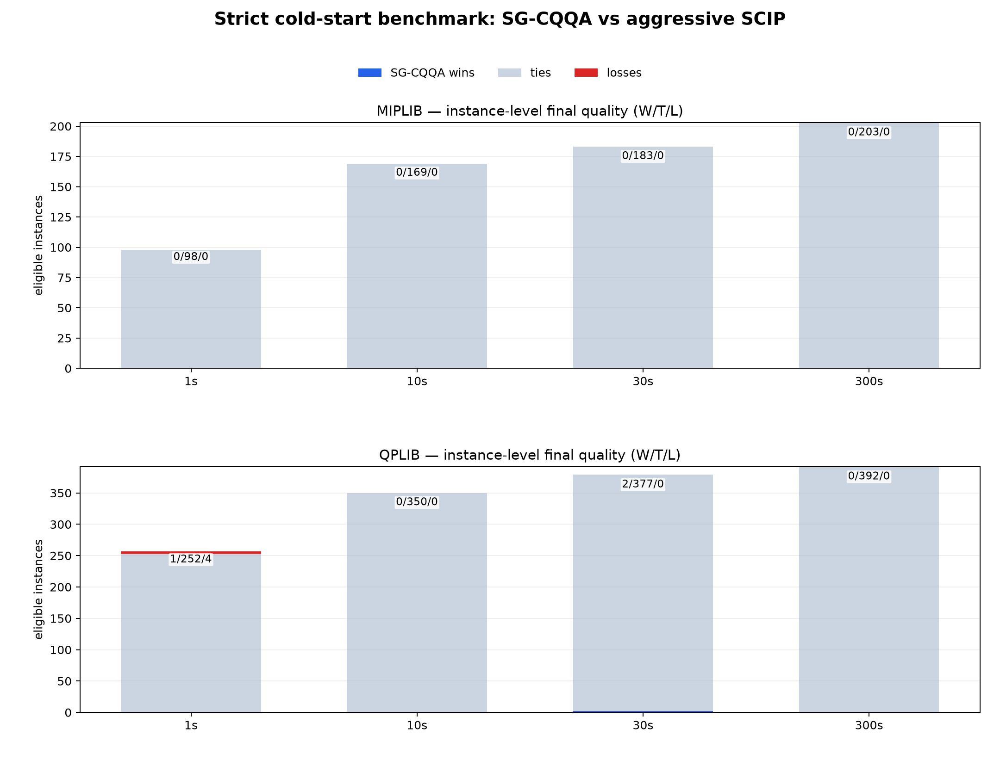
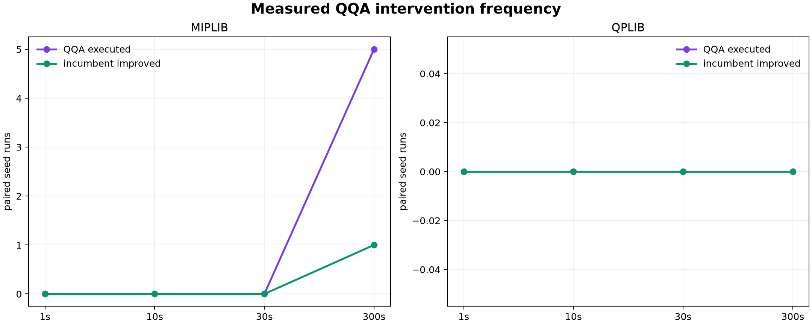

# Public MIPLIB/QPLIB results

This is the canonical, reviewable aggregate record. Campaigns are reported
without selecting favourable instances, and failures are never converted into
wins or ties. Full solution vectors and private execution artifacts are not
committed; only path-free aggregate data and figures are published here.

## Strict all-instance campaign (2026-09-06)

This sealed campaign evaluated all 240 MIPLIB 2017 benchmark instances and all
453 public QPLIB instances at 1, 10, 30, and 300 seconds, with five seeds and
two independently executed solvers. It requested 27,720 runs, completed
26,501, retained 1,219 failures, and produced 19,360 feasible solution vectors
that passed in-run original-model verification. The exact portable aggregate is
available as [JSON](assets/benchmarks/strict-2026-09-06/summary.json), with a
separate [validation report](assets/benchmarks/strict-2026-09-06/validation.json).

### Coverage and QQA activity

| Library | Budget | Completed / requested | Failed | Paired seed runs | Feasible SCIP → SG-CQQA | QQA executed / directly improved |
| --- | ---: | ---: | ---: | ---: | ---: | ---: |
| MIPLIB | 1 s | 2,400 / 2,400 | 0 | 1,200 | 470 → 467 | 0 / 0 |
| MIPLIB | 10 s | 2,400 / 2,400 | 0 | 1,200 | 790 → 790 | 0 / 0 |
| MIPLIB | 30 s | 2,392 / 2,400 | 8 | 1,196 | 870 → 870 | 0 / 0 |
| MIPLIB | 300 s | 2,362 / 2,400 | 38 | 1,179 | 976 → 975 | 5 / 1 |
| QPLIB | 1 s | 4,294 / 4,530 | 236 | 2,145 | 1,224 → 1,221 | 0 / 0 |
| QPLIB | 10 s | 4,235 / 4,530 | 295 | 2,117 | 1,666 → 1,666 | 0 / 0 |
| QPLIB | 30 s | 4,261 / 4,530 | 269 | 2,128 | 1,805 → 1,806 | 0 / 0 |
| QPLIB | 300 s | 4,157 / 4,530 | 373 | 2,077 | 1,883 → 1,881 | 0 / 0 |

### Outcomes

W/T/L is always SG-CQQA versus aggressive SCIP. Final quality compares
feasibility first and then the directional reference error or objective.
Instance-level rows aggregate the five seeds before classification. The
primal integral is the matched anytime metric; lower is better.

| Library | Budget | Final seed W/T/L | Final instance W/T/L | Integral instance W/T/L |
| --- | ---: | ---: | ---: | ---: |
| MIPLIB | 1 s | 26 / 1,149 / 25 | 0 / 98 / 0 | 27 / 185 / 21 |
| MIPLIB | 10 s | 7 / 1,184 / 9 | 0 / 169 / 0 | 41 / 141 / 51 |
| MIPLIB | 30 s | 5 / 1,183 / 8 | 0 / 183 / 0 | 65 / 118 / 50 |
| MIPLIB | 300 s | 13 / 1,159 / 7 | 0 / 203 / 0 | 76 / 64 / 92 |
| QPLIB | 1 s | 62 / 2,019 / 64 | 1 / 252 / 4 | 91 / 261 / 71 |
| QPLIB | 10 s | 5 / 2,098 / 14 | 0 / 350 / 0 | 141 / 133 / 143 |
| QPLIB | 30 s | 20 / 2,097 / 11 | 2 / 377 / 0 | 161 / 104 / 155 |
| QPLIB | 300 s | 7 / 2,067 / 3 | 0 / 392 / 0 | 172 / 60 / 187 |

The conservative startup gate intentionally prevented QQA execution in every
1-, 10-, and 30-second cell. It also prevented numerical QQA calls on QPLIB at
300 seconds, although five runs registered the lightweight plugin. Those rows
measure the matched SCIP path and cold-process variability, not a QQA
advantage. On MIPLIB at 300 seconds, QQA executed on all five seeds of
`gen-ip054`: final-quality W/T/L was 2/2/1, primal-integral W/T/L was 2/0/3,
and one QQA candidate directly improved the incumbent. This is a narrow,
measured intervention benefit, not suite-wide or universal dominance over
SCIP. None of the instance-level primal-integral sign tests was significant at
5%; exact p-values are retained in the JSON.

### Strict protocol and limitations

- Revision `f30b9f82b79dcf9bc09c9538c7e3e75a8567f8fb` used one SCIP, LP, and
  Torch thread per run. Solver order was balanced by portable instance name
  and seed.
- Every solver ran in a fresh isolated interpreter. The clock began before
  original-model import, and structurally bypassed SG-CQQA cells were executed
  independently rather than copied from the baseline.
- The selected hybrid used float64, four candidates, 16 replicas, 20 epochs,
  and a 5% measured callback-overhead cap. CPU was selected for these small
  screened cores; accelerator correctness was checked separately and is not
  presented as a runtime result.
- Original-coordinate vectors were retained for validation. The post-run
  validator checked each expected dimension, solution-hash presence, and
  recorded maximum infeasibility; domain, integrality, bound, and feasibility
  checks occurred against the original model in each isolated run. Published
  aggregates contain no machine name, scheduler identifier, account, private
  path, or command line.
- The native process cap includes a bounded shutdown and serialization grace.
  Consequently 3,968 completed cold-clock rows exceeded the nominal budget by
  more than 0.1 seconds, predominantly at the shortest budgets. These rows are
  retained, counted in the validation JSON, and not silently relabelled.
- The 1,219 unmeasured runs comprise bounded worker timeouts and isolated
  backend failures. They are excluded from paired W/T/L calculations. Longer
  QPLIB cells record more backend failures; their normalized classes remain
  machine-readable, but no failed cell is assigned to either solver.

The pre-registered settings and public snapshot hashes are shipped in
`qqa/benchmarking/manifests/audit-public.toml`. See the
[reproduction guide](miplib-qplib.md#metrics-and-reproducibility) for portable
fetch, shard, resume, merge, and publish commands.

## Historical 2026-08-26 campaign

The following earlier campaign is retained without selecting only favourable
instances. Full per-instance results and incumbent trajectories remain
generated artifacts rather than repository-root data.

| Campaign identity | Value |
| --- | --- |
| Date | 2026-08-26 |
| Summary schema | 1 |
| Primary comparison | `sg-cqqa` vs `scip-aggressive` |
| Budget | 30 seconds per solver run |
| Historical seed count | 1 |

### Protocol

- The primary comparison is `sg-cqqa` against the matched
  `scip-aggressive` ablation. Both use one SCIP/LP thread, seed 0, the same
  public instance, reference snapshot, and a 30-second total solver budget.
- MIPLIB contains all 240 benchmark-set instances. QPLIB contains all 453
  public instances. The campaign configuration recorded `cuda` for MIPLIB and
  `cpu` for QPLIB. The pre-fix MIPLIB implementation did not forward that
  device field into the inner QQA solve, so its QQA calls actually used CPU;
  device forwarding is fixed for subsequent runs. This does not alter the
  recorded solution comparisons, but the campaign must not be used as a GPU
  runtime measurement. No machine, scheduler, host, or private path metadata
  is retained.
- Final-quality W/T/L first compares feasibility and then directional
  reference error (or the original objective when no reference is available).
  Primal-integral W/T/L uses a common 30-second horizon; lower is better.
- QPLIB's sparse algebraic import is common preparation outside each paired
  solver clock. Solver-model construction, plugin setup, QQA, completion, and
  SCIP are inside the budget. Each native run is process-isolated.
- The QQA-only ablation sets `fast_candidates=0` and permits 20% heuristic
  overhead. The primary hybrid uses two fast candidates, a continuous-
  completion escalation gate, and a 10% overhead cap.

### Screened non-regression profile

A later conservative campaign added explicit structural bypasses, a 0.1%
minimum completion improvement, core-coverage gates, in-place dive completion,
and QPLIB `PROBTYPE` routing. Both suites use one solver/LP/Torch thread, seed
0, a 30-second budget, balanced execution
order, and `scip-aggressive` as the direct baseline.
The generated manifest intentionally omits `implementation_revision` because
the campaign was generated before that implementation had a commit identity.
The omission preserves provenance instead of assigning a later refactor SHA.

| Library | Requested instances | Successful pairs | Final W/T/L | Integral W/T/L | QQA-executed pairs |
| --- | ---: | ---: | ---: | ---: | ---: |
| MIPLIB | 240 | 240 | 1 / 239 / 0 | 1 / 239 / 0 | 1 |
| QPLIB | 453 | 437 | 0 / 437 / 0 | 1 / 436 / 0 | 1 |
| Combined | 693 | 677 | 1 / 676 / 0 | 2 / 675 / 0 | 2 |

On the two pairs where QQA actually executed, final quality is 1/1/0 and
primal integral is 2/0/0. MIPLIB uses a 32-variable applicability gate and
QPLIB uses a 64-variable gate plus an explicit `QML` allow-list. Every other
successful pair is an exact reuse of the matched aggressive-SCIP baseline,
marked `equivalent_baseline_reuse`; those ties demonstrate suite-level
non-regression but are not evidence that QQA improved the instance. QPLIB has
the same 16 process-isolated failures for both solvers, so failures are not
counted as wins or losses.

Six-seed checks on the two active families recorded final-quality 1/5/0 for
`gen-ip054` and 1/5/0 for `QPLIB_0031`. The anytime metric remained sensitive
to the heuristic cost. Increasing QPLIB completion from 0.25 to 1 second was
rejected: its six-seed final result was 1/4/1 despite a stronger local
incumbent on the losing seed. These results support the short, selective
profile; they do not establish universal dominance over SCIP on arbitrary
instances, seeds, or time limits.

### Earlier broad primary full-suite comparison

| Library | Paired instances | Feasible baseline → SG-CQQA | Final W/T/L | Integral W/T/L | Median primal error baseline → SG-CQQA | Median integral baseline → SG-CQQA |
| --- | ---: | ---: | ---: | ---: | ---: | ---: |
| MIPLIB | 240/240 | 177 → 177 | 6 / 194 / 40 | 12 / 116 / 112 | 0.07450 → 0.08511 | 25.573 → 26.875 |
| QPLIB | 437/453 | 348 → 351 | 43 / 361 / 33 | 145 / 133 / 159 | 0.06129 → 0.07407 | 14.669 → 14.144 |

On QPLIB's 437 successfully paired instances, the primary hybrid has more
final-quality wins than losses (43 versus 33), finds three additional feasible
solutions, and lowers the median primal integral. It does not dominate every
anytime comparison: integral wins/losses are 145/159, and its median final
reference error is higher.

On MIPLIB, the 30-second primary hybrid is weaker than aggressive SCIP: six
final wins versus 40 losses, with equal feasible counts. This negative result
is retained in full. The primary MIPLIB candidate path generated 631
candidates; 47.70% completed feasibly, 44.37% were accepted, and 6.97%
improved the original incumbent. The QQA subset generated 175 candidates with
76.57% completion, 70.29% acceptance, and 2.86% incumbent improvement.

For QPLIB, the primary path generated 489 candidates with 39.47% feasible
completion, 38.85% acceptance, and 14.72% incumbent improvement. Its 63 QQA
candidates had 46.03% completion, 44.44% acceptance, and 3.17% incumbent
improvement.

### QQA-only ablation

| Library | Paired instances | Paired feasible baseline → SG-CQQA | Final W/T/L | Integral W/T/L | QQA acceptance | QQA incumbent improvement |
| --- | ---: | ---: | ---: | ---: | ---: | ---: |
| MIPLIB | 240/240 | 177 → 177 | 4 / 191 / 45 | 6 / 115 / 119 | 43.51% | 7.42% |
| QPLIB | 437/453 | 350 → 350 | 23 / 361 / 53 | 97 / 135 / 205 | 36.09% | 10.06% |

QQA-only loses more often than the gated primary hybrid on both libraries.
The result supports using QQA conditionally inside SCIP, with cheap surrogate
candidates and completion evidence, rather than invoking it as an unconditional
replacement for native primal heuristics.

### Additional diagnostics

The five-second CPU MIPLIB screening compares plain SCIP, aggressive SCIP,
and the primary hybrid on all 240 instances. Against aggressive SCIP,
SG-CQQA records 8/226/6 final W/T/L but 13/166/61 primal-integral W/T/L;
feasible counts are 139 versus 138. The configured minimum QQA reserve prevents
QQA calls at this short horizon, so this is a fast-surrogate screening result,
not evidence for the learned QQA path.

A two-instance QPLIB diagnostic uses three seeds on one binary `QBL` and one
mixed-binary/continuous `QML` instance. Across six pairs, SG-CQQA records
4/0/2 for both final quality and primal integral. This small, previously
explored diagnostic is published for seed sensitivity only and is not used as
an estimate of full-library performance.

### Failures and limits

All requested runs were attempted. MIPLIB completed 480/480 primary and
480/480 QQA-only runs without failure. In the QPLIB primary campaign,
874/906 runs completed and 32 anonymous failures covered the same 16 instances
for both solvers: 28 bounded worker timeouts and four native-process failures.
The QQA-only campaign completed 875/906 runs with 31 failures: 28 worker
timeouts and three native-process failures. Consequently 437/453 QPLIB
instances have direct paired measurements in each campaign.

These failures are not counted as wins or losses. They are preserved by
basename, solver, seed, and error class in the artifacts. Native isolation
keeps a failed nonlinear or exceptionally large model from terminating the
remaining campaign; it does not turn an unmeasured run into a result.

The benchmark establishes a QPLIB final-quality advantage for this fixed
30-second primary campaign, but not universal superiority. In particular,
MIPLIB and the QQA-only ablations remain negative, one seed is insufficient
for a broad stochastic claim, and longer budgets may change the ranking.

### Snapshot identity

- MIPLIB 2017 benchmark-v2 archive: `c756eefd544d83b31809306b45d3549a1a5b9378e6aa78b68738b1a3b6a418fa`
- MIPLIB solution snapshot v36: `9236602294c1a5aca5248b6f7d03689a7533ea3cbf3f3d92cff962e752e20af84`
- QPLIB public archive: `b3596e1264ed57c5f6a44e822679f5c9138e1985fe74bc8341c3becbc666b9fd`
- QPLIB solution snapshot: `6e024cd786b3049e572a96fbe89ddd0d73ff4d6bcac0c0427e9086d378dc0c43`

The snapshots were retrieved from the official public sources on 2026-08-25
(UTC). See the [MIPLIB download page](https://miplib.zib.de/download.html),
[MIPLIB benchmark set](https://miplib.zib.de/set_benchmark.html),
[QPLIB instances](https://qplib.zib.de/instances.html), and
[QPLIB format documentation](https://qplib.zib.de/doc.html).
